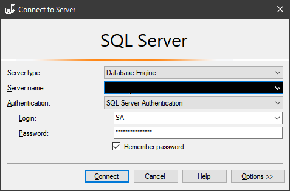

Setting up SQL SERVER on a Docker Container is so ***easy*** that I cringe at all of the times that I have installed a full-blown SQL SERVER instance on my systems in the past.  

> What used to take a few hours with several touch points, now just takes a couple of commands and a few mins.

Also, since this is on Docker, SQL SERVER is fully isolated from the rest of my system.

## Let's Get This Done

Install the latest with `docker pull`:

```powershell
docker pull mcr.microsoft.com/mssql/server:2017-latest
```

Set the SA password:

```powershell
docker run -e "ACCEPT_EULA=Y" -e "SA_PASSWORD=<YourStrong@Passw0rd>" `
   -p 1433:1433 --name sql1 `
   -d mcr.microsoft.com/mssql/server:2017-latest
```

Now, you are free to connect to it with **sqlcmd**, or you can connect directly from SQL SERVER Management Studio:



Be sure to use the `hostname` as the **Server name**.

> This entire setup took 5 mins and is amazingly simple!

## Refs

- [https://docs.microsoft.com/en-us/sql/linux/quickstart-install-connect-docker?view=sql-server-2017&pivots=cs1-powershell](https://docs.microsoft.com/en-us/sql/linux/quickstart-install-connect-docker?view=sql-server-2017&pivots=cs1-powershell)